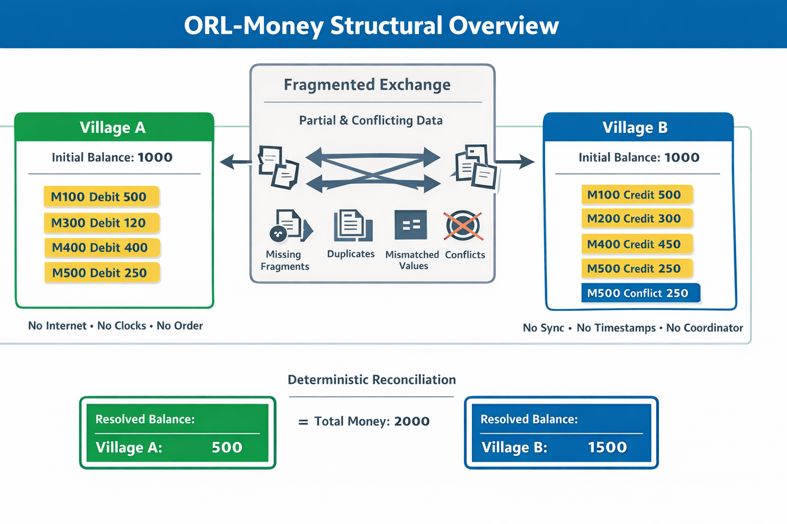

# ⭐ ORL-Money

**Orderless Ledger — Money System**

-black)


**Deterministic money reconciliation where correctness emerges from structure.**

**Structure-Based Financial Resolution • Open Reference Implementation**

---

No Time • No Order • No Coordinator  
No Timestamps • No Continuous Connectivity Required for Financial Correctness  

Financial correctness derived from structure — not from order, timestamps, or synchronization

Built on structure-first principles from the Shunyaya framework

---

## ⚡ Try it in 30 seconds

Run the reference demo:

```
python demo/orl_money_demo_reference.py
```

Run the multi-node demo:

```
python demo/orl_money_demo_multinode.py
```


In under a minute, observe:

- deterministic reconciliation from fragmented money data  
- safe handling of `INCOMPLETE` and `ABSTAIN` states  
- bounded structural sharing across nodes  
- identical final truth without time, order, or a coordinator  

---

## ⚡ The One-Line Breakthrough

Two independent systems exchange incomplete, delayed, and even conflicting money fragments — and still arrive at the exact same correct final balance.

No communication guarantees. No ordering guarantees. No timing guarantees.

Yet correctness is guaranteed for structurally valid transactions under ORL-Money resolver rules.

---

## 🧾 Structural Lineage

ORL-Money extends the structure-first logic of ORL into financial reconciliation.

It is the domain-level proof that financial correctness can also emerge from structure.

---

## 🧭 Visual Overview



---

## 🔗 Quick Links

### 📘 Docs

- [Quickstart](docs/Quickstart.md)
- [FAQ](docs/FAQ.md)
- [Test Guide](docs/Test-Guide.md)
- [Proof Sketch](docs/Proof-Sketch.md)
- [Structural Overview](docs/ORL-Money-Structural-Overview.png)

---

### ⚡ Demos

- [Python Reference Demo](demo/orl_money_demo_reference.py)
- [Multi-Node Demo](demo/orl_money_demo_multinode.py)
- [Visual Demo (HTML)](demo/orl_money_demo_v1.html)

---

### 🔍 Verification

- [Verify Instructions](verify/VERIFY.txt)
- [Demo Hash Freeze](verify/FREEZE_DEMO_SHA256.txt)

---

### 📂 Repository

- [demo/](demo/) — reference and multi-node demonstrations  
- [docs/](docs/) — conceptual and usage documentation  
- [verify/](verify/) — reproducibility and verification

---

## 💡 What ORL-Money Demonstrates

This system proves that financial correctness does not require:

- timestamps  
- transaction ordering  
- synchronized systems  
- continuous connectivity  

Instead:

`correctness = structure`

---

## ⚖️ What ORL-Money Is / Is Not

**ORL-Money IS:**

- a structural financial reconciliation model  
- a deterministic correctness layer  
- a proof that money consistency need not depend on order  
- a structure-first convergence demonstration  
- a domain application of ORL  

**ORL-Money IS NOT:**

- a full banking core  
- a payment network replacement  
- a consensus protocol  
- a claim that order disappears from all systems  

ORL-Money should be understood as a reconciliation and verification layer for financial correctness under fragmented, delayed, or disconnected conditions.

It introduces a deeper shift:

financial truth is derived from structure, not from sequence

---

## 🔥 The Core Structural Law

```
valid structure -> RESOLVED
missing structure -> INCOMPLETE
conflicting structure -> ABSTAIN
```


No guessing. No forcing. No correction layers.

---

## 🛡 Classical Compatibility Guarantee

ORL-Money is a conservative structural extension.

For all valid financial transactions:

`classical result = ORL result`

For incomplete or conflicting structure:

```
INCOMPLETE -> no forced movement
ABSTAIN -> no unsafe movement
```


This ensures:

- no false money creation  
- no silent corruption  
- no deviation from valid financial outcomes  

---

## 🧮 Mathematical Guarantees

**Convergence (Order Independence):**  
`resolve(structure_A ∪ structure_B) = resolve(structure_B ∪ structure_A)`

**Idempotence (No Double Counting):**  
`bounded_union(S, S) = S`

**Deduplication Invariance:**  
`resolve(S) = resolve(deduplicate(S))`

**Money Conservation:**  
`total_money_initial = total_money_final`

**Resolved Flow Conservation:**  
`sum(resolved_debits) = sum(resolved_credits)`

**Determinism:**  
Given identical structure, all nodes produce identical results.

**Structural Completeness Rule:**  
A transaction is `RESOLVED` iff exactly one debit AND one matching credit exist with equal amount.

---

## 🧭 The Scenario

Two isolated village systems:

VillageA  
VillageB  

Initial balances:

VillageA = 1000  
VillageB = 1000  

They operate:

- without internet  
- without clocks  
- without ordering  
- without coordination  

---

## 🧪 Fragmented Reality

Node A sees:

- M100 debit 500  
- M300 debit 120  
- M400 debit 400  
- M500 debit 250  

Node B sees:

- M100 credit 500  
- M200 credit 300  
- M400 credit 450  
- M500 credit 250  
- M500 conflicting credit 250  

---

## ⚙️ Structural Resolution

Each node computes:

`resolve(structure)`

Final result after bounded sharing:

```
VillageA = 500
VillageB = 1500
```

---

## 🔍 Transaction Outcomes

```
M100 -> RESOLVED
M200 -> INCOMPLETE
M300 -> INCOMPLETE
M400 -> ABSTAIN
M500 -> ABSTAIN
```

---

## 🛡 Safety Model

```
INCOMPLETE -> no movement
ABSTAIN -> no movement
```


These are protections — not failures.

---

## 🧠 What This Means

- money is never duplicated  
- money is never falsely moved  
- conflicts do not corrupt balances  
- all nodes converge to the same truth  

---

## ⚡ What This Challenges

Traditional assumption:

`financial correctness = order + time + synchronization`

ORL-Money shows:

`financial correctness = structure`

---

## 🧱 Minimal Integration

```
input fragments -> resolve(structure) -> safe output
```


Add ORL-Money as a:

- reconciliation layer  
- audit layer  
- verification layer  

---

## 🚀 Quick Start

```
python demo/orl_money_demo_reference.py
```


---

## 🚀 Multi-Node Demo

```
python demo/orl_money_demo_multinode.py
```

Expected:

```
VillageA = 650
VillageB = 1300
VillageC = 1050
```


---

## 🧩 Tiny Resolver Surface

Core functions:

- `deduplicate(entries)`  
- `resolve(entries)`  
- `bounded_union(a, b)`  
- `ledger_signature(...)`  

Deterministic • Replay-verifiable • Minimal  

---

## 📊 Comparison

| Model | Order | Time | Safe Incomplete | Safe Conflict | Deterministic |
|------|------|------|----------------|--------------|--------------|
| Traditional | Yes | Yes | Limited | Limited | Conditional |
| Eventual | Sometimes | Sometimes | Partial | Partial | Conditional |
| Blockchain | Yes | Often | Limited | Strong | Conditional |
| **ORL-Money** | No | No | Yes | Yes | Yes |

---

## 🌍 Real-World Implications

- offline payments  
- rural banking  
- disaster recovery  
- cross-border reconciliation  
- disconnected systems  

---

## 🧭 Adoption Path

**Easy:** reconciliation, audit, offline sync  
**Moderate:** banking back-office, telecom  
**Advanced:** core infrastructure  

---

## 📜 License

See: [LICENSE](LICENSE)

Reference Implementation: Open Standard  
Architecture: CC BY-NC 4.0  

---

## 🔗 Related Structural References

- [ORL](https://github.com/OMPSHUNYAYA/Orderless-Ledger)
- [STOCRS](https://github.com/OMPSHUNYAYA/STOCRS)
- [SSUM-Time](https://github.com/OMPSHUNYAYA/SSUM-Time)

---

## 🧭 Final Statement

Correctness did not come from coordination.  
Correctness did not come from time.  
Correctness did not come from order.  

Correctness emerged from structure.


