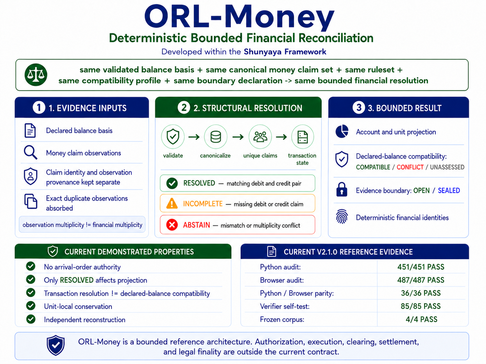

# ⭐ ORL-Money

**Deterministic Bounded Financial Reconciliation**


**A public deterministic reference model for bounded reconciliation of supported money fragments.**

ORL-Money extends ORL into a financial example domain.

For the supplied scenarios, independent nodes can begin with different supported money fragments and, after receiving the same deduplicated fragment set, produce the same transaction states and demonstrated balance projection under the same resolver rules.

The governing relation is:

`same initial balances + same deduplicated supported money fragments + same resolver rules -> same bounded financial snapshot`

ORL-Money is developed within the Shunyaya Framework.

---

## ⚡ Try It in 30 Seconds

Run the two-node reference demonstration:

```text
python demo/orl_money_demo_reference.py
```

Run the three-node demonstration:

```text
python demo/orl_money_demo_multinode.py
```

The demonstrations show:

- different initial node views
- exact duplicate absorption
- explicit `RESOLVED`, `INCOMPLETE`, and demonstrated `ABSTAIN` outcomes
- scripted bounded fragment sharing
- identical resolver snapshots after nodes receive the same evidence
- balance effects produced only by `RESOLVED` transactions
- preservation of the demonstrated total balance under matching debit-credit pairs

---

## 🧾 Structural Lineage

ORL-Money is a domain application of ORL.

ORL provides the general bounded fragment-resolution pattern.

ORL-Money adds:

- initial balance snapshots
- debit and credit fragments
- resolved balance effects
- demonstrated net-balance conservation
- financial-domain examples and terminology

ORL-Money is a reference model and demonstration.

It is not a banking core, payment rail, settlement system, or production financial platform.

---

## 🧭 Visual Overview



---

## 🔗 Quick Links

### 📘 Documentation

- [Quickstart](docs/Quickstart.md)
- [FAQ](docs/FAQ.md)
- [Test Guide](docs/Test-Guide.md)
- [Model and Invariant Sketch](docs/Proof-Sketch.md)
- [Structural Overview](docs/ORL-Money-Structural-Overview.png)

### ⚡ Demonstrations

- [Python Reference Demo](demo/orl_money_demo_reference.py)
- [Python Multi-Node Demo](demo/orl_money_demo_multinode.py)
- [Browser Demo](demo/orl_money_demo_v1.html)

### 🔍 Verification

- [Verification Instructions](verify/VERIFY.txt)
- [Frozen Demo Hashes](verify/FREEZE_DEMO_SHA256.txt)

### 📂 Repository Layout

- [demo/](demo/) — reference, multi-node, and browser demonstrations
- [docs/](docs/) — model, usage, testing, and visual documentation
- [verify/](verify/) — artifact-identity and execution guidance

---

## 💡 Core Model

ORL-Money classifies supported transaction fragments through deterministic resolver rules.

Conceptually:

`bounded_financial_snapshot = resolve(initial_balances, supported_money_fragments, resolver_rules)`

For the current supplied model:

`one debit + one credit + matching amount -> RESOLVED`

`missing counterpart -> INCOMPLETE`

`debit_credit_mismatch OR demonstrated_same_transaction_multiplicity_conflict -> ABSTAIN`

Only `RESOLVED` transactions contribute to the demonstrated balance projection.

`INCOMPLETE` and `ABSTAIN` transactions produce no demonstrated balance effect.

---

## 🧩 Current Supported Fragment Shape

The committed demonstrations use entries with four fields:

```text
tx
side
account
amount
```

Example:

```text
{"tx": "M100", "side": "debit", "account": "VillageA", "amount": 500}
```

The current demonstrations expect supported values shaped like the committed examples.

A formal input schema and explicit invalid-input refusal are future hardening targets.

---

## 🔁 Same-Evidence Resolution

Let:

- `B` be an initial balance snapshot
- `E` be a supported money-fragment collection
- `D(E)` be exact-duplicate absorption
- `F_v(B,E)` be the financial resolver and projection under ruleset version `v`

For two nodes using the same initial balances and resolver rules:

`B_i = B_j AND D(E_i) = D(E_j) -> F_v(B_i,E_i) = F_v(B_j,E_j)`

This means that nodes holding the same deduplicated supported evidence produce the same bounded output.

ORL-Money does not claim that nodes with permanently different evidence must produce the same result.

---

## 🔀 Arrival-Order Independence

For a supported fragment collection `E`, a supported permutation `P(E)`, and a fixed resolver version `v`, the intended current-model invariant is:

`F_v(B,P(E)) = F_v(B,E)`

The resolver classifies the committed scenario from fragment content rather than fragment arrival position.

A future stronger release should test this invariant across a declared permutation corpus and additional adversarial vectors.

---

## ♻️ Exact Duplicate Absorption

Exact duplicate fragments are absorbed before classification.

`D(D(E)) = D(E)`

For the committed examples:

`F_v(B,E) = F_v(B,D(E))`

This prevents an identical repeated fragment from being counted more than once in the demonstrated resolver model.

This is exact-fragment deduplication.

It is not a complete payment-duplication or double-spend prevention system.

---

## 🧮 Demonstrated Balance Projection

For each `RESOLVED` matching pair:

`debit_amount = credit_amount`

The resolver applies:

`from_account_delta = -amount`

`to_account_delta = +amount`

Therefore, for each demonstrated resolved pair:

`sum(resolved_balance_effects) = 0`

For the supplied examples:

`sum(final_balances) = sum(initial_balances)`

This is demonstrated net-balance conservation for the committed matching-pair scenarios.

It is not a universal money-conservation theorem or proof of financial-system correctness.

---

## 🧭 Two-Node Reference Scenario

Initial balances:

```text
VillageA = 1000
VillageB = 1000
```

Node A begins with:

```text
M100 debit  VillageA 500
M300 debit  VillageA 120
M400 debit  VillageA 400
M500 debit  VillageA 250
```

Node B begins with:

```text
M100 credit VillageB     500
M100 credit VillageB     500
M200 credit VillageB     300
M400 credit VillageB     450
M500 credit VillageB     250
M500 credit VillageB_Alt 250
```

The repeated `M100` credit is an exact duplicate and is absorbed.

After both nodes receive the same merged supported fragment set, the expected transaction states are:

```text
M100 -> RESOLVED
M200 -> INCOMPLETE
M300 -> INCOMPLETE
M400 -> ABSTAIN
M500 -> ABSTAIN
```

Expected state summary:

```text
RESOLVED  = 1
INCOMPLETE = 2
ABSTAIN   = 2
```

Expected resolved balance effects:

```text
VillageA = -500
VillageB = +500
```

Expected final demonstrated balances:

```text
VillageA = 500
VillageB = 1500
```

Expected node-equality result:

```text
all_nodes_equal = True
```

---

## 🌐 Three-Node Demonstration

Run:

```text
python demo/orl_money_demo_multinode.py
```

The three nodes begin with different supported fragment sets and exchange them through two scripted sharing rounds.

Expected final demonstrated balances:

```text
VillageA = 650
VillageB = 1300
VillageC = 1050
```

Expected final states:

```text
M100 -> RESOLVED
M200 -> RESOLVED
M300 -> RESOLVED
M400 -> ABSTAIN
M500 -> ABSTAIN
```

Expected final state summary:

```text
RESOLVED = 3
ABSTAIN  = 2
```

Expected convergence check after round 2:

```text
round_2_match = True
```

The scripted exchange is a test mechanism.

It is not a consensus, reliable-broadcast, networking, or settlement protocol.

---

## ✅ What the Current Demonstrations Establish

For the supplied scenarios, ORL-Money demonstrates:

- deterministic output under unchanged supported inputs
- same-evidence node equality
- exact duplicate absorption
- explicit incompleteness
- abstention for the demonstrated amount mismatch
- abstention for the demonstrated same-transaction multiplicity conflict
- no balance effect from demonstrated `INCOMPLETE` or `ABSTAIN` transactions
- net-zero resolved balance effects for matching debit-credit pairs
- local execution without GPS, NTP, internet access, database access, or server dependency after download
- no use of timestamps or fragment arrival position as transaction-classification authority

These are bounded scenario claims.

They are not universal guarantees for arbitrary financial data or architectures.

---

## ⚖️ What ORL-Money Is

ORL-Money is:

- a bounded financial-fragment reconciliation reference model
- a deterministic resolver demonstration
- an ORL domain application
- an educational and research artifact
- a basis for later schema, conformance, and independent-verification work

---

## 🛡 What ORL-Money Is Not

ORL-Money does not implement or prove:

- authorization
- identity or account ownership
- available-funds verification
- overdraft policy
- account posting
- payment execution
- clearing or settlement
- finality
- fraud prevention
- cryptographic signatures
- consensus
- Byzantine fault tolerance
- reliable broadcast
- complete double-spend prevention
- complete malformed-input validation
- regulatory compliance
- production readiness
- universal financial correctness
- universal order independence
- safe operation on arbitrary or hostile input

The current demonstrations should not be used to move real money.

---

## 🔐 Verification Scope

The repository provides two distinct verification activities.

### Reference-Scenario Checking

The Python and browser demonstrations can be checked against the documented expected:

- transaction states
- state summaries
- balance effects
- final demonstrated balances
- same-evidence node equality

### Artifact Identity

The committed SHA-256 values identify the frozen demo files.

`same bytes -> same SHA-256 hash`

A successful hash comparison proves artifact identity.

It does not by itself prove behavioral correctness, complete conformance, cross-engine equality, production safety, or universal financial correctness.

---

## 🧩 Current Resolver Surface

The reference implementations expose a small core:

- `entry_key(entry)`
- `deduplicate(entries)`
- `resolve(entries)`
- `bounded_union(node_entries, incoming_entries)`
- `ledger_signature(balances, tx_state)`
- `apply_effects(initial_balances, balance_effects)`

The surface is intentionally compact so that the current model can be inspected and reproduced.

Compactness does not replace validation, conformance testing, or production controls.

---

## 🔬 Research and Integration Direction

ORL-Money may inform future work in:

- reconciliation research
- offline evidence synchronization
- deterministic audit reconstruction
- disconnected-system comparison
- back-office discrepancy classification
- canonical financial-fragment exchange
- independently verifiable resolver receipts

Any real deployment would require additional authorization, identity, validation, security, accounting, networking, legal, operational, and regulatory layers.

---

## 🧭 Future Technical Direction

A stronger revision should add:

- a formal supported-input schema
- explicit invalid-input refusal
- non-negative and domain-specific amount rules
- exact cross-language amount representation
- canonical serialization
- delimiter-safe identifiers
- deterministic byte-wise ordering
- assertion-based expected outputs
- a permutation corpus
- malformed-input vectors
- adversarial conflict vectors
- Python and browser conformance tests
- versioned resolver receipts
- independent reconstruction
- a separately defined structural-closure layer

Future target relation:

`same validated initial balances + same validated canonical money fragments + same ruleset version -> same independently verified bounded financial snapshot`

This stronger layer is not part of the current demonstrations.

---

## 📜 License

See [LICENSE](LICENSE).

Reference implementation: **ORL Open Use License v1.0**

Unless otherwise stated, architecture descriptions, diagrams, and documentation: **CC BY-NC 4.0**

---

## 🔗 Related Structural References

- [ORL](https://github.com/OMPSHUNYAYA/Orderless-Ledger)
- [STOCRS](https://github.com/OMPSHUNYAYA/STOCRS)
- [SSUM-Time](https://github.com/OMPSHUNYAYA/SSUM-Time)

---

## 🧭 Final Statement

ORL-Money demonstrates a bounded structural alternative to using timestamps or fragment arrival order as financial-fragment classification authority.

For the supplied scenarios:

`same initial balances + same deduplicated supported money fragments + same resolver rules -> same bounded transaction states and balance projection`

Missing supported structure is not guessed.

Demonstrated conflicting structure is not forced.

Only demonstrated `RESOLVED` transactions affect the balance projection.
